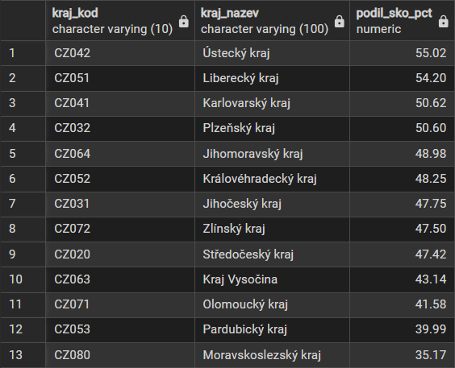
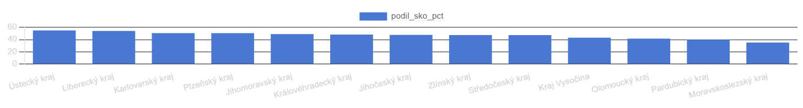
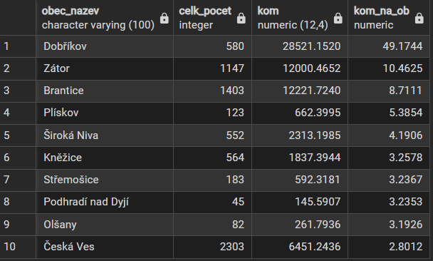
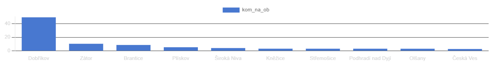
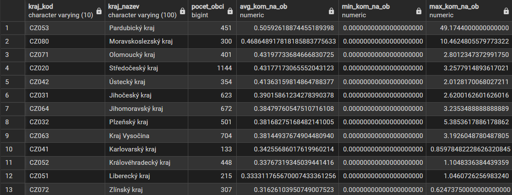
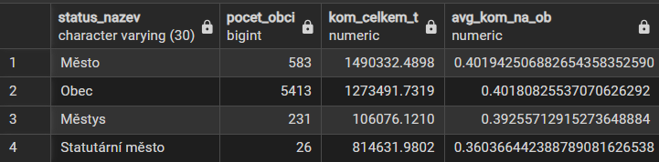
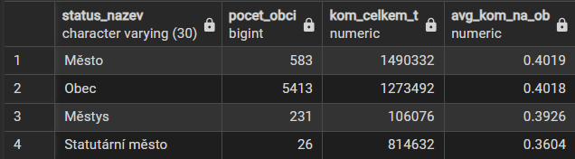
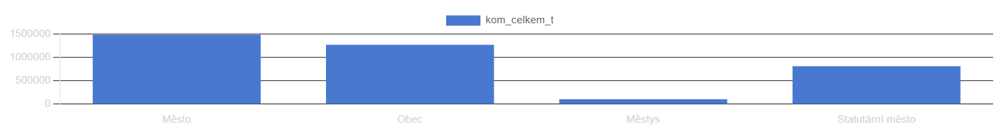

# Produkce komunálních odpadů v ČR – SQL projekt

Databáze obcí České republiky s daty o produkci komunálního odpadu.

Z důvodu dat o počtu obyvatel jen za rok 2024 (k datu 1.1.2025), jsem používal jen relevantní informace za rok 2024.

---

## Požadavky

- [Docker Desktop](https://www.docker.com/products/docker-desktop/)

---

## Spuštění

```bash
docker compose up
```

Příkaz automaticky:
1. Spustí PostgreSQL databázi
2. Vytvoří schéma a načte data ze zdrojových souborů
3. Vytvoří pohled `v_obce_prehled`
4. Spustí pgAdmin

---

## pgAdmin

Otevřete v prohlížeči: **http://localhost:5050**

Email `admin@szz.cz`
Heslo `admin`

Server `szz_db` se připojí automaticky — stačí se přihlásit.

Dotazy spusť z `core/04_queries.sql` v Query Toolu.

---

## Výsledky dotazů


-- 1. PODÍL SMĚSNÉHO ODPADU NA CELKOVÉM V JEDNOTLIVÝCH KRAJÍCH




-- 2. TOP 10 OBCÍ S NEJVĚTŠÍ PRODUKCÍ KO NA OBYVATELE




-- 3. PRŮMĚRNÁ PRODUKCE KO NA OBYVATELE V KAŽDÉM KRAJI



-- 4. CELKOVÁ PRODUKCE ODPADŮ ZA ČR



-- 5. PRODUKCE KO PODLE TYPU OBCE

